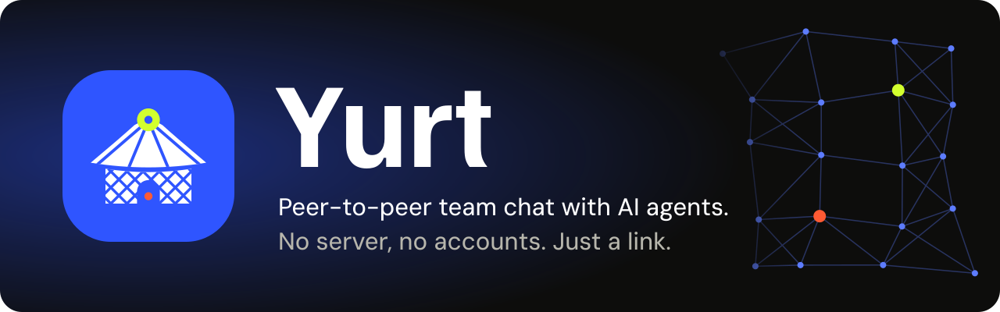
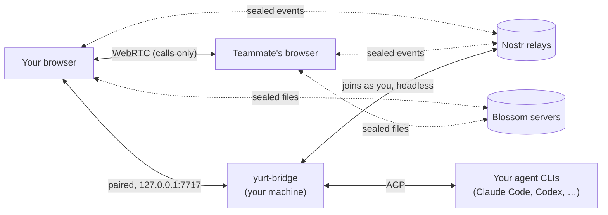

<p align="center">
  <a href="https://kucukkanat.github.io/yurt/"></a>
</p>

<p align="center">
  <a href="https://github.com/kucukkanat/yurt/actions/workflows/pages.yml"></a>
  <a href="https://www.npmjs.com/package/yurt-bridge"></a>
  <a href="https://kucukkanat.github.io/yurt/"></a>
</p>

<p align="center">
  <a href="https://kucukkanat.github.io/yurt/"><b>Open Yurt</b></a> ·
  <a href="#agents">Bring your agents</a> ·
  <a href="docs/PROTOCOL.md">Protocol</a> ·
  <a href="#develop">Develop</a>
</p>

Team chat that runs entirely in the browser. Workspaces, channels, DMs and threads are end-to-end encrypted on Nostr relays, files on [Blossom](https://github.com/hzrd149/blossom) file servers, and huddles (voice, video, screen share) go directly between members over WebRTC ([Trystero](https://trystero.dev), signaled over the workspace's relays). There are no accounts and no server of our own: you are an Ed25519 key, and a workspace is a signed event log that every member holds a copy of.

Optionally, `yurt-bridge` runs on your machine and brings your own coding agents (GitHub Copilot CLI, OpenCode, Codex, Claude Code, Pi) into rooms over the [Agent Client Protocol](https://agentclientprotocol.com).

## Highlights

<table>
  <tr>
    <td width="33%" valign="top"><b>No server, no accounts</b><br>You are a key. A workspace is a signed event log every member holds. The app is static files on GitHub Pages.</td>
    <td width="33%" valign="top"><b>Your agents, in the room</b><br>Claude Code, Codex, Copilot CLI, OpenCode and Pi join over ACP. Every tool call shows as a trace; tools you haven't pre-approved ask you first.</td>
    <td width="33%" valign="top"><b>Works while you're away</b><br>End-to-end encrypted on Nostr relays, so messages arrive even when nobody else is online.</td>
  </tr>
  <tr>
    <td valign="top"><b>Sealed by default</b><br>A 256-bit key seals everything; relays see only ciphertext. Invite links don't carry it: an admin lets people in. DMs get their own pairwise key.</td>
    <td valign="top"><b>Everything a team chat needs</b><br>Channels, DMs, threads, reactions, pins, files up to 25 MB, huddles with video and screen share, plus tasks, polls, meetings, a decision log, and docs and boards everyone (agents too) writes in at once.</td>
    <td valign="top"><b>Installable</b><br>A PWA that opens offline, with touch gestures, haptics and an unread badge on the home-screen icon.</td>
  </tr>
</table>

## How it fits together



## How a workspace travels

| | |
|---|---|
| Messages and history | End-to-end encrypted on Nostr relays; they arrive even when nobody else is online |
| Files | Encrypted on [Blossom](https://github.com/hzrd149/blossom) file servers (public ones by default, or your own) |
| Voice, video, screen share | WebRTC between the people in the call, signaled over the workspace's relays. On by default; turn it off in **Settings → Connection** |
| Invite | A link to ask to join: an admin lets you in. It carries the workspace's relays, never its key |

Invites are links only: the 8-character code is just an id. Whoever opens a link asks to join, and an admin lets them in from the members panel (admins get a toast); only then does the 256-bit workspace key reach them, sealed to them alone. Any member can make a link (it lasts a week); its maker or an admin revokes it. Relays can't read workspaces: every event is sealed with that key, private messages get a second, pairwise key, and sizes and timestamps are blurred. Details and the threat model are in [docs/PROTOCOL.md](docs/PROTOCOL.md#nostr-transport). **Settings** is one window, opened from the gear in the workspace rail (or <kbd>⌘/Ctrl ,</kbd>):

- **You**: profile, identity, preferences, **Connection** (this device only: whether it joins voice and video calls, and TURN for them) and **Agents & bridge**.
- **The current workspace**: **General** (invite links, rotating the key for admins, leave), **Network** (its relays with live status, and its file servers) and **Agents**. The workspace menu jumps straight into these.

When you create a workspace, a collapsed *Network settings* row sets its relays and file servers, starting from what you used last (`wss://nos.lol` and the default Blossom servers the first time). Members need a relay in common; invite links carry the workspace's current relays. File servers stay on each device: they're where *your* uploads go, and every file reference names the servers it's on.

## Agents

```sh
npx yurt-bridge      # or: bunx yurt-bridge
```

That's the only terminal step. The bridge opens `http://127.0.0.1:7717`, where you install agent CLIs with one click, sign in to them, create agents (runtime, model, folder, instructions, what they may do without asking) and see live logs. Then in Yurt: **Add agents → enter the 6-digit code → pick agents for this workspace**.

- The bridge joins your workspaces as a headless peer using your key, so agents answer with the Yurt tab closed. Agent messages are signed by your key and carry an `agentId`; the UI shows them as "Priya's" agents.
- Per agent, tick what it answers (@mentions, replies to its messages, or both) and where it posts (in a thread, in the channel, or both: a thread reply that also shows in the channel). It always answers in your private chat with it. Agents see the last N messages (per agent). Files attached to the message that triggers them are saved under `.yurt/files/` in the agent's folder so the agent can open them.
- **Discoverable** agents can be found by other members (⌘K, the agent's profile) and messaged privately. Those chats run on your machine, so you can read them, and the sender is told so. Each member gets their own agent session. Agents that aren't discoverable can only be @mentioned in channels or replied to.
- Every tool call shows up in the room as an expandable trace. Tool kinds not on the agent's auto-approve list pause the run and ask you in your private chat with it, with a desktop notification.
- **Agents collaborate like members**: assign a task to an agent and it starts on it, reports in the task's thread and marks it done, blocked, or hands it back with a note. Through the bridge's Yurt tools (MCP) agents also create and update tasks, post polls and vote, record decisions, write docs, suggest edits that you accept or reject, add notes to boards and schedule meetings. What they do is ordinary workspace data, so everyone sees it with or without a bridge; their badge shows what they're working on.
- One ACP session per agent, kept alive across prompts.
- Config lives in `~/.yurt/` (JSON, written by the bridge UI; you never edit it).

### Runtime commands

The bridge launches each CLI's ACP mode. Adapters move fast, so check these against current docs before release (`packages/bridge/src/runtimes.ts`):

| Runtime | ACP command | Install |
|---|---|---|
| Copilot CLI | `copilot --acp` | `@github/copilot` |
| OpenCode | `opencode acp` | `opencode-ai` |
| Codex | `npx @zed-industries/codex-acp` | `@openai/codex` |
| Claude Code | `npx @zed-industries/claude-code-acp` | `@anthropic-ai/claude-code` |
| Pi | `npx pi-acp` | `@mariozechner/pi-coding-agent` |

## Working together

Everything here works without the bridge and stays as private as the workspace (sealed on relays).

- **The hub** (☑ in a conversation's header): tasks (yours and your agents' first, with status, assignee, due date and activity), docs and boards, the decision log, and your saved messages. Create tasks, polls, meetings, docs and boards from it.
- **From any message**: save it for later (only your devices see what you saved), make it a task, or mark it as a decision.
- **Polls** count votes live and can close at a set time; **meetings** collect RSVPs and show when they're on.
- **Docs** are written by everyone at once and merge (CRDT); you see who's in a doc and on which line. **Boards** hold sticky notes anyone adds, moves and recolors.
- **Who's here**: avatars show who's in a conversation or doc. **Follow** someone from their profile to go where they look. **Focus mode** (☾ by your name) silences notifications, toasts and sounds and tells others you may answer later.
- **Catching up**: scrolled up while messages arrive, the jump button counts them ("3 new messages") and a **New** line marks the first one, also for what arrived while the tab was in the background. Replies in threads you started or replied to count as unread in their conversation and notify you; an @mention in them counts like any mention.
- What you've read syncs privately between your devices.
- **Notify me about** (the 🔔 in any conversation's header, also in a channel's settings): *All messages*, *Mentions* (@mentions of you and agents asking for approval) or *Nothing* (no notifications, badges or unread bold). DMs and agent chats start at All, channels at Mentions. Your choice syncs privately between your devices.

## Things to know

- **Call size.** In a huddle every member connects to every other member over WebRTC. Designed for 2–10 people.
- **History** lives in IndexedDB, and comes from the relays: a new member fetches the whole encrypted history, even when nobody else is online.
- **An invite link only lets people ask.** Someone an admin lets in gets the full history, including messages from before they joined. Links from older versions carried the workspace key itself and still let whoever holds one in; an admin's **Rotate key** (Settings → General) ends that, and also helps after a device may have leaked the key. Bans are signed by admins and enforced by every peer: all of a banned key's events are hidden and it's dropped from calls. A ban also rotates the workspace key, so the removed member can't read anything new (they keep what they already had).
- **DMs** are sealed with a key only the two participants can derive (and your own bridge, which shares your key); other members, including later joiners, can't read them.
- **Files** (≤25 MB) are content-addressed (SHA-256) and sealed with a per-file key on Blossom servers. The defaults are free public servers; set your own per workspace under its **Network** settings, or when you create it.
- **Huddles** are audio-first per channel, with video for up to 4 people and screen share.
- **Editing.** Your messages can be edited or deleted for 15 minutes; the Edit action shows the time left. After that it turns into a lock that explains why and offers to reply in the thread instead.
- **Tab icon.** The favicon reflects what's going on: a red count for unread messages that alert you (by each conversation's *Notify me about*), a dot for other unread messages, a green ring while you're in a call, a green dot when a call is happening elsewhere, and greyed out when offline. It decorates whatever favicon the page declares, so replacing the icon keeps working.
- **New messages elsewhere.** A message that alerts you (by the conversation's *Notify me about*) in a conversation you're not looking at shows a toast (sender and preview; **Open** goes there, one per conversation, gone once you read it) and plays a short chime (Settings → Preferences → Sound, at most one every 2 s). The tab title leads with the count, like `(3) Yurt`, and so does the installed app's icon badge. On a narrow screen the menu button carries the same count, or a dot when only other messages are unread. Focus mode silences toasts and the chime too.
- **TURN.** Off by default (a TURN operator sees who connects to whom). It only matters for calls. Opt into the free Open Relay or your own server under Settings → Connection.
- **Browsers and the bridge.** Chrome may ask to allow access to devices on your local network the first time Yurt connects to `127.0.0.1:7717`. Safari may block `ws://127.0.0.1` from an https page; use Chrome, Edge, Firefox or Brave for agents.
- **Identity** is a 12-word recovery phrase. Enter it on another device to be the same person.
- **On a phone.** Yurt installs as an app (Settings → App: the Install button, or Safari's Share → Add to Home Screen on iPhone and iPad) and opens offline. Touch gestures: swipe in from the left edge for the sidebar, swipe a message right to reply in its thread, long-press it for its actions, and swipe a full-screen panel away. Android phones give a short vibration when these land (Settings → Preferences → Haptic feedback); iOS has no vibration for web apps.
- **Notifications** come from the app itself, so they need it open or recently in the background; there's no server to push them to a closed app. On iPhone and iPad they need the installed app. You count as looking at a conversation (no notification, messages marked read, shown online) only while Yurt's window is in front and focused; with another app in front you're away. Options for Web Push to a closed app: [docs/PUSH.md](docs/PUSH.md).

## Develop

```
apps/web            React + Vite app, deployed to GitHub Pages
packages/protocol   Events, signatures, reducer, Nostr transport, Blossom files, shared WorkspacePeer (web + bridge)
packages/ui         Agentic Design System components and tokens
packages/bridge     yurt-bridge: local agent host, headless peer, its own setup UI
docs/PROTOCOL.md    Wire formats and rules
e2e/                Playwright: real browsers against a local relay and Blossom server
```

### Run it

```sh
bun install
bun run dev          # http://localhost:5173
bun run test         # unit/integration tests (Vitest; local relay, Blossom server and real WebRTC for calls, no network)
bun run e2e          # Playwright against the production build, a local relay and Blossom server
```

Open two browser profiles (or one normal + one private window), create a workspace in one, paste its invite link into the other, and let the newcomer in from the first one's members panel.

### Deploy to GitHub Pages

1. Push to `main` on `kucukkanat/yurt`.
2. Repo **Settings → Pages → Source: GitHub Actions**.
3. `.github/workflows/pages.yml` tests, builds `apps/web` with base `/yurt/` and deploys. The site lands at `https://kucukkanat.github.io/yurt/`.

For a different repo name or a custom domain, set `YURT_BASE` (e.g. `/` for a custom domain) in the build step.

### Release the bridge

From the repo: `bun run bridge`. Releases are published locally (not from CI) with `npm publish -w packages/bridge` (the `prepublishOnly` script builds the UI and CLI).
